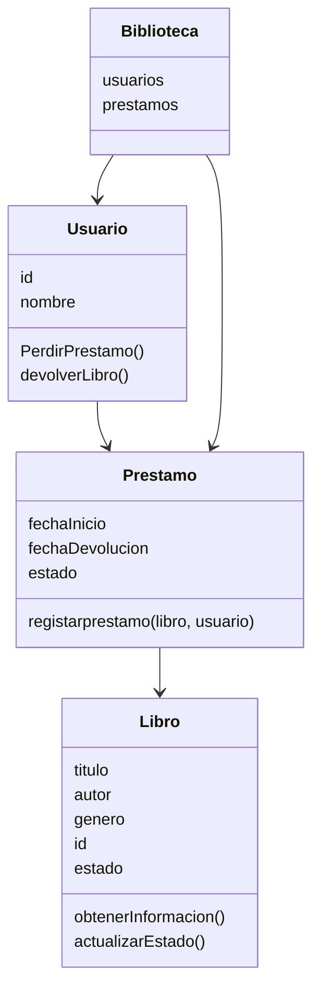

```mermaid
   classDiagram
    direction TB
    class Biblioteca {
        usuarios
        prestamos
    }

    class Libro {
        titulo
        autor
        genero
        id
        estado
        obtenerInformacion()
        actualizarEstado()
    }

    class Usuario {
        id
        nombre
        PerdirPrestamo()
        devolverLibro()
    }

    class Prestamo {
        fechaInicio
        fechaDevolucion
        estado
        registarprestamo(libro, usuario)
    }

    Usuario --> Prestamo
    Prestamo --> Libro
    Biblioteca --> Usuario
    Biblioteca --> Prestamo


```
